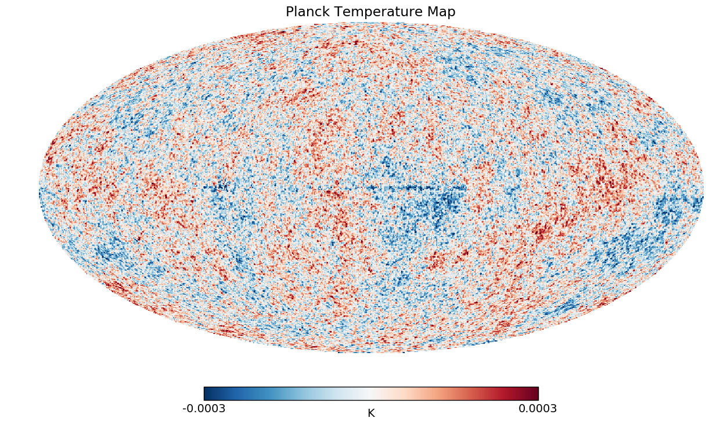
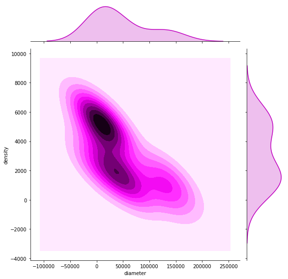

# AstroViz

A beginner's attempt to visualization astronomical data. More details to follow!

## Planck's Mission

Data and Maps available here: http://pla.esac.esa.int/pla/#maps

## Cosmic Microwave Background Full Mission Maps

This data is saved using Flexible Image Transport System format, prefered by Cosmologists. Find more about the image format [here](https://en.wikipedia.org/wiki/FITS)

### SMICA

Spectral-Matching Independent Component Analysis Method

### Planets Correlation Matrix

### Kernel Density Estimator of Density and Diameter

#### Credits

Credits to Dr. Caroline Clark for her well presented talk at PyLondon 2017. [Click here for the full talk](https://youtu.be/LN_20z_JY58)